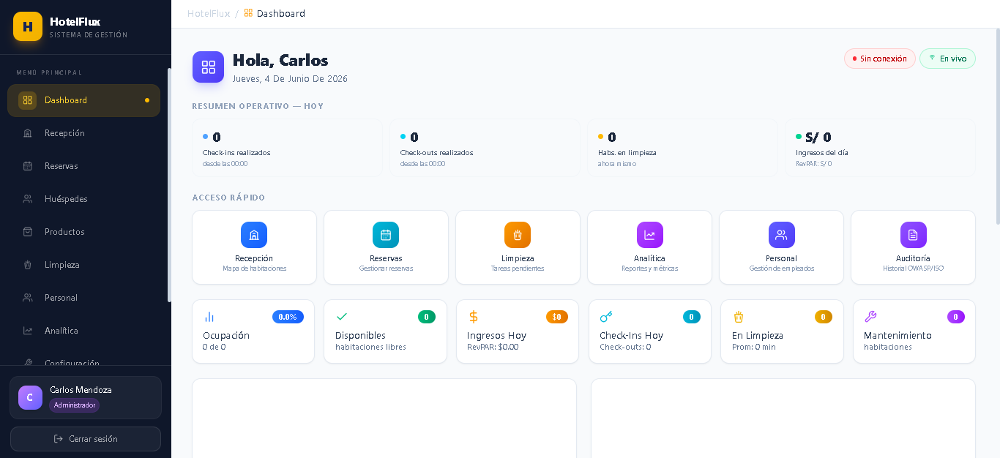
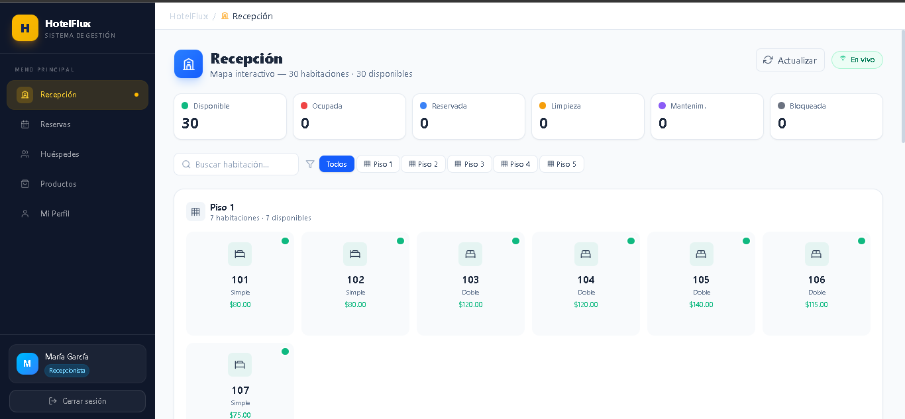
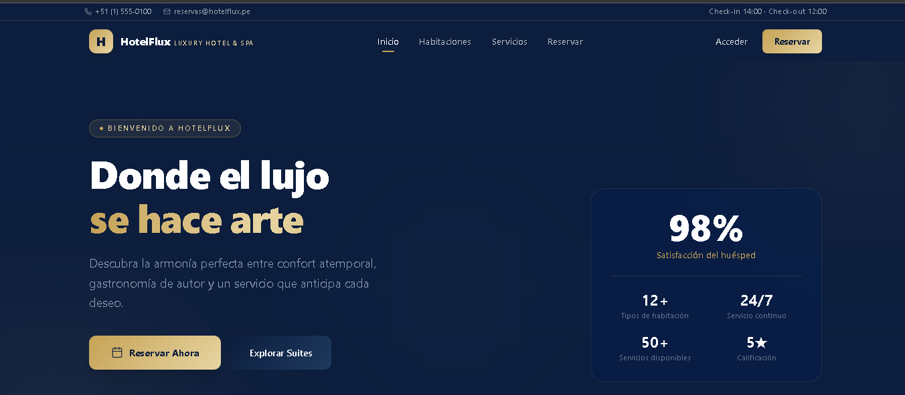
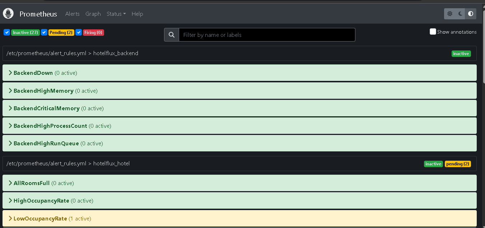
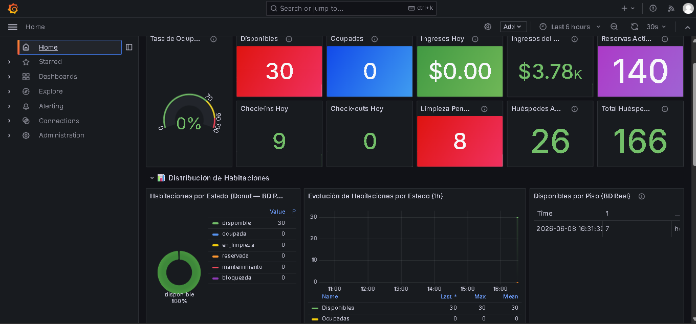

# 🏨 HotelFlux — Sistema de Gestión Hotelera Reactiva

> **Proyecto académico** — Programación Funcional y Reactiva — Noveno Ciclo
>
> Backend: **Elixir/Phoenix 1.7 + WebSockets + PubSub**
> Frontend: **React 19 + TypeScript 5.7 + RxJS 7.8**
> BD: **PostgreSQL 18** | Cache: **Redis 8** | Jobs: **Oban 2.18**
> Stack: **Docker Compose + Nginx 1.27**

---

<div align="center">

### Stack Tecnológico


### Patrones de Diseño


### Seguridad


</div>

---

## 📸 Capturas de Pantalla

### Panel de Administración (Personal)
Mapa de habitaciones reactivo, KPIs en tiempo real, gestión de reservas con Saga Pattern, analítica avanzada y auditoría ISO 27001.



### Recepción
Mapa de pisos interactivo con estados codificados por color, modal de reserva directa de 3 pasos, actualización vía WebSocket en tiempo real.



### Portal del Cliente
Landing page luxury, búsqueda de disponibilidad, flujo de reserva de 4 pasos, consulta por código de confirmación, cumplimiento Ley N° 29733.



### Monitoreo — Prometheus
Métricas del backend Phoenix, reglas de alerta y recording rules para KPIs del hotel, dashboards personalizados.



### Dashboards — Grafana
Visualización de métricas en tiempo real con paneles de ocupación, ingresos, estado del sistema y logs centralizados.



---

## Tabla de Contenidos

1. [Visión General](#-visión-general)
2. [Arquitectura del Sistema](#-arquitectura-del-sistema)
3. [Inicio Rápido con Docker](#-inicio-rápido)
4. [Estructura del Proyecto](#-estructura-del-proyecto)
5. [Observable Repository Pattern](#-observable-repository-pattern)
6. [Saga Pattern — Reservas Compensadas](#-saga-pattern)
7. [Patrones Funcionales y Reactivos](#-patrones-demostrados)
8. [Seguridad — OWASP + ISO 27001](#-seguridad)
9. [El Manifiesto Reactivo](#-el-manifiesto-reactivo)
10. [Concurrencia BEAM (Elixir)](#-concurrencia-beam-elixir)
11. [Frontend — Componentes Clave](#-frontend--componentes-clave)
12. [Bloqueante vs No-Bloqueante](#-bloqueante-vs-no-bloqueante)
13. [Schedulers: asyncScheduler y queueScheduler](#-schedulers-asyncscheduler-y-queuescheduler)
14. [Paradigma Funcional vs Imperativo](#-paradigma-funcional-vs-imperativo)
15. [Roles y Credenciales](#-roles-y-acceso)
16. [API Endpoints](#-api-endpoints)
17. [Historias de Usuario](#-historias-de-usuario)
18. [Docker Services](#-docker-services)
19. [Stack Tecnológico Completo](#-stack-tecnológico)
20. [Testing](#-informe-de-testing)
21. [Comandos Útiles (Makefile)](#-comandos-makefile)
22. [Documentación Adicional](#-documentación)

---

## 🎯 Visión General

**HotelFlux** es un sistema completo de gestión hotelera que demuestra la aplicación práctica de **programación funcional** (Elixir) y **programación reactiva** (RxJS) en un escenario real: dos frontends (cliente + personal) que comparten un único backend Phoenix con WebSockets, desplegados con Docker Compose y Nginx como reverse proxy.

### ¿Qué hace único a este proyecto?

| Característica | Descripción |
|---|---|
| **Observable Repository** | Los repositorios devuelven streams (`Observable<Result<T>>`) que emiten valores en cada cambio, no promesas puntuales. El frontend se actualiza automáticamente sin polling. |
| **Hexagonal + Clean** | Arquitectura de puertos y adaptadores en el backend; Clean Architecture en los dos frontends. El dominio está completamente desacoplado de la infraestructura. |
| **CQRS + Event Sourcing** | Separación clara de comandos y queries; tabla de eventos inmutables que permite reconstruir estado histórico con recursión TCO. |
| **Saga Pattern** | Reservas de 5 pasos con compensación automática: si cualquier paso falla, los anteriores se revierten (consistencia eventual). |
| **FSM Pura** | Máquina de estados finita implementada como funciones puras en Elixir — sin efectos secundarios, con BFS recursivo TCO. |
| **Railway Oriented Programming** | Manejo de errores funcional con `{:ok, v}` / `{:error, e}` en pipelines encadenados con `with` y `|>`. |
| **RBAC completo** | 5 roles (admin, gerente, recepcionista, limpieza, mantenimiento) con vistas y acciones filtradas. |
| **Auto-seed al levantar** | `docker compose up` ejecuta migraciones y seeds automáticamente. El seed es idempotente. |
| **Seguridad OWASP + ISO 27001** | 9 plugs de seguridad, 14 controles OWASP A01-A10, 13 controles ISO 27001. |
| **Observabilidad completa** | Prometheus + Grafana + Loki + 3 exporters (PostgreSQL, Redis, Nginx). |

### Aplicaciones desplegadas

```
┌─────────────────────────┐    ┌─────────────────────────┐
│  Portal Cliente         │    │  Panel Personal         │
│  (frontend-cliente)     │    │  (frontend-personal)    │
│  Puerto: 3001           │    │  Puerto: 3003           │
│  React 19 + RxJS        │    │  React 19 + RxJS        │
│  Público                │    │  Login + RBAC           │
│  Catálogo + reservas    │    │  Mapa + KPIs + admin    │
└──────────┬──────────────┘    └──────────┬──────────────┘
           │                              │
           └──────────┬───────────────────┘
                      │  HTTP/WS → :80/:8080 (Nginx)
                      ▼
           ┌──────────────────────────────┐
           │   Phoenix Backend (:4000)    │
           │   REST + WebSockets          │
           │   Observable Repositories    │
           └──────────┬───────────────────┘
                      │
       ┌──────────────┼──────────────┐
       ▼              ▼              ▼
   PostgreSQL 18   Redis 8    Oban (jobs)
```

---

## 📐 Arquitectura del Sistema

```
┌──────────────────────────────────────────────────────────────────────────────┐
│                              NGINX (puerto 80 / 8080)                          │
│         Reverse Proxy  ·  SSL/TLS-ready  ·  Rate Limiting  ·  OWASP Headers  │
├──────────────────────────────┬───────────────────────────────────────────────┤
│    /        → Portal Cliente  │   /admin/*  →  Panel Personal                 │
│    /api/*   →  Backend        │   /socket  →  WebSocket  →  Backend           │
│    /metrics → Prometheus      │   /api/auth/*  →  Rate Limit 10r/min          │
├──────────────────────────────┴───────────────────────────────────────────────┤
│                                                                              │
│   ┌─────────────────────────────────────┐  ┌──────────────────────────────┐  │
│   │      PHOENIX BACKEND (Elixir)       │  │   2 × REACT FRONTENDS (TS)    │  │
│   │                                     │  │                              │  │
│   │  Hexagonal Architecture             │  │  Clean Architecture          │  │
│   │  ┌────────────────────────────────┐ │  │  ┌────────────────────────┐ │  │
│   │  │  🏛️ DOMAIN (Lógica pura)      │ │  │  │  domain/ (Funciones)   │ │  │
│   │  │  - 11 entidades inmutables     │ │  │  │  - result.ts (Monad)   │ │  │
│   │  │  - FSM, Event Sourcing, ROP     │ │  │  │  - entidades/*         │ │  │
│   │  │  - Tree Walker (TCO)            │ │  │  │  - higher-order/       │ │  │
│   │  ├────────────────────────────────┤ │  │  ├────────────────────────┤ │  │
│   │  │  🔌 PORTS (Contratos)          │ │  │  │  application/          │ │  │
│   │  │  - Input: behaviours casos uso │ │  │  │  - ports/ (interfaces) │ │  │
│   │  │  - Output: behaviours repos    │ │  │  │  - use-cases/ (HOF)    │ │  │
│   │  ├────────────────────────────────┤ │  │  ├────────────────────────┤ │  │
│   │  │  🔧 ADAPTERS                   │ │  │  │  streams/ (RxJS)      │ │  │
│   │  │  - 11 repos + Observable Repo  │ │◄─►│  - operators/          │ │  │
│   │  │  - Redis: cache/locks/blacklist │ │WS│  │  - composite/          │ │  │
│   │  │  - Oban workers                 │ │  │  ├────────────────────────┤ │  │
│   │  ├────────────────────────────────┤ │  │  │  hooks/ (bridges)     │ │  │
│   │  │  🎭 USE CASES + SAGAS          │ │  │  │  - useAuth, useObs...  │ │  │
│   │  └────────────────────────────────┘ │  │  ├────────────────────────┤ │  │
│   │                                     │  │  │  components/ + pages/  │ │  │
│   │  Web Layer:                         │  │  │  - Pagination (shared) │ │  │
│   │  - 14 controllers CQRS              │  │  │  - Layout, Modal, etc. │ │  │
│   │  - 4 channels WebSocket             │  │  └────────────────────────┘ │  │
│   │  - 9 plugs de seguridad             │  │                              │  │
│   └─────────────────────────────────────┘  └──────────────────────────────┘  │
│                                                                              │
│   ┌──────────────┐  ┌──────────────┐  ┌────────────────┐  ┌──────────────┐   │
│   │  PostgreSQL  │  │    Redis     │  │   Prometheus    │  │   Grafana    │   │
│   │      18      │  │      8       │  │   + Alerting   │  │  + Loki Logs │   │
│   └──────────────┘  └──────────────┘  └────────────────┘  └──────────────┘   │
└──────────────────────────────────────────────────────────────────────────────┘
```

Para la arquitectura detallada con diagramas de flujo, decisiones de diseño (ADR), guía de extensión y métricas de calidad, consulta **[ARCHITECTURE.md](./ARCHITECTURE.md)**.

### Flujo de capas (Hexagonal Backend)

```
Solicitud HTTP
     │
     ▼
  Router.ex (pipeline: api → auth → admin_only)
     │
     ▼
  Controller (comando/query CQRS)
     │
     ▼
  UseCase / Saga (lógica de negocio pura)
     │
     ├──► Port.Input (comportamiento, interfaz)
     │         │
     │         ▼
     │    Port.Output (contratos de infraestructura)
     │         │
     │    ┌────┴──────────────────────────────────────┐
     │    ▼                                           ▼
     │ Adapter.Repo (Ecto + PostgreSQL)       Adapter.Cache (Redix + Redis)
     │ + Observable Repository                 + PubSub broadcast
     │
     ▼
  Channel (suscrito a PubSub)
     │
     ▼
  WebSocket → RxJS Stream → React Component
```

---

## 🚀 Inicio Rápido

### Requisitos
- Docker 24+ y Docker Compose v2
- 4 GB de RAM libres
- Puertos 80, 3001, 3003, 4000, 5432, 8080 disponibles

### Levantar el stack completo

```bash
# 1. Clonar
git clone <repo-url>
cd funcionalreactiva

# 2. Verificar variables de entorno (debe tener .env)
cp .env.example .env   # si no existe

# 3. Levantar todo (build + up + auto-seed)
docker compose --profile default up -d --build

# Para incluir observabilidad (Prometheus, Grafana, Loki):
docker compose --profile default --profile obs up -d --build

# 4. Verificar estado
docker compose ps
```

El `docker-compose.yml` está configurado con un servicio `backend-init` que ejecuta **migraciones + seeds automáticamente** antes de que arranque el backend. El seed es idempotente (chequea `count` + `on_conflict: :nothing`), por lo que re-ejecutarlo no duplica datos.

### Accesos

| URL | Servicio | Notas |
|---|---|---|
| `http://localhost` | Portal Cliente + Proxy | Nginx reverse proxy |
| `http://localhost:8080` | Portal Cliente (alias) | |
| `http://localhost:3001` | Portal Cliente (directo) | Sin proxy |
| `http://localhost:3003` | Panel Personal (directo) | Sin proxy |
| `http://localhost:4000` | Backend REST + WebSocket | API directa |
| `http://localhost:4000/health` | Health check backend | |
| `http://localhost:4000/metrics` | Prometheus metrics | |
| `http://localhost:3002` | Grafana (con profile obs) | admin / pass desde .env |
| `http://localhost:9090` | Prometheus (con profile obs) | |

### Con Makefile (atajos)

```bash
make help         # Lista todos los comandos
make up           # Levantar core
make up-obs       # Core + observabilidad (Grafana :3002, Prometheus :9090)
make ps           # Estado de servicios
make health       # Health-check de todos los endpoints
make logs         # Logs en vivo
make down         # Detener stack (conserva datos)
make clean-all    # Reset total (borra imágenes + BD)
```

### Verificar funcionamiento

```bash
# Health check
curl http://localhost:4000/health
# → {"status":"ok","version":"1.0.0","app":"HotelFlux"}

# Login
curl -X POST http://localhost:4000/api/v1/auth/login \
  -H "Content-Type: application/json" \
  -d '{"email":"admin@hotelflux.com","password":"Admin123!"}'
# → {"token":"eyJhbGc...","usuario":{...}}
```

### Reset completo (con datos sembrados de nuevo)

```bash
docker compose --profile default --profile obs down -v --rmi all
docker compose --profile default --profile obs up -d --build   # re-siembra solo
```

---

## 🗂️ Estructura del Proyecto

```
funcionalreactiva/
│
├── README.md                          # Este archivo
├── ARCHITECTURE.md                    # Arquitectura detallada con diagramas
├── Makefile                           # Comandos rápidos (make help)
├── docker-compose.yml                 # Stack local (auto-seed, 512 líneas)
├── docker-compose.core.yml            # Core services
├── docker-compose.prod.yml            # Stack producción
├── .env / .env.example                # Variables de entorno
├── WEBSOCKET_ERROR_ANALYSIS.md        # Análisis de errores WebSocket
├── WEBSOCKET_NGINX_FIX.md             # Fix de WebSocket con Nginx
├── diagnose-websocket.sh              # Script de diagnóstico WS
│
├── imegens/                           # Capturas de pantalla
│   ├── paneladmin.png                 #   Panel admin personal
│   ├── panelrecep.png                 #   Panel recepción
│   ├── paginacliente.png              #   Portal cliente
│   ├── Prometehus.png                 #   Prometheus
│   └── graphana.png                   #   Grafana
│
├── nginx/                             # Reverse proxy (compartido con otros proyectos)
│   └── nginx.conf                     #   HotelFlux + CrackGuard + Tours + Portafolio
│
├── infra/                             # Observabilidad (profile: obs)
│   ├── prometheus/                    #   Prometheus config + alertas + recording rules
│   │   ├── prometheus.yml
│   │   ├── alert_rules.yml
│   │   └── recording_rules.yml
│   ├── grafana/                       #   Grafana provisioning + dashboards
│   │   ├── provisioning/
│   │   │   ├── datasources/
│   │   │   │   └── datasource.yml
│   │   │   └── dashboards/
│   │   │       └── dashboard.yml
│   │   └── dashboards/
│   │       ├── hotelflux-main.json
│   │       ├── hotelflux-system.json
│   │       ├── hotelflux-hotel.json
│   │       └── hotelflux-logs.json
│   └── loki/                          #   Logs agregados
│       ├── loki-config.yml
│       └── promtail-config.yml
│
├── .github/                           # CI/CD
│   └── workflows/
│       └── ci-cd.yml
│
├── .vscode/
│   └── settings.json
│
├── backend/                           # === ELIXIR/PHOENIX API ===
│   ├── Dockerfile                     #   Multi-stage (Elixir 1.17 → Alpine)
│   ├── mix.exs                        #   15+ dependencias
│   ├── .dockerignore
│   ├── config/                        #   config.exs, dev.exs, prod.exs, test.exs, runtime.exs
│   ├── lib/
│   │   ├── hotelflux/                 #   === DOMAIN / CORE ===
│   │   │   ├── domain/                #   16 archivos: entidades + FSM + ROP + ES + TreeWalker
│   │   │   │   ├── habitacion.ex      #   Entidad + FSM + soft delete + Event Sourcing
│   │   │   │   ├── reserva.ex         #   Entidad reserva + estados
│   │   │   │   ├── huesped.ex         #   Entidad huésped + validación documento
│   │   │   │   ├── usuario.ex         #   Entidad usuario + OWASP password policy
│   │   │   │   ├── producto.ex        #   Entidad producto + categorías
│   │   │   │   ├── pago.ex            #   Entidad pago
│   │   │   │   ├── piso.ex            #   Entidad piso
│   │   │   │   ├── turno.ex           #   Entidad turno
│   │   │   │   ├── horario_personal.ex #  Entidad horario
│   │   │   │   ├── tarea_limpieza.ex  #   Entidad tarea limpieza + prioridad
│   │   │   │   ├── consumo.ex         #   Entidad consumo
│   │   │   │   ├── evento.ex          #   Entidad evento de dominio
│   │   │   │   ├── reserva_servicio.ex #  Entidad servicio de reserva
│   │   │   │   ├── result.ex          #   Result Monad (ok/err/map/flat_map/fold)
│   │   │   │   ├── combinators.ex     #   ROP combinators (map_ok, flat_map_ok, validate_with)
│   │   │   │   ├── state_machine.ex   #   FSM genérica (transiciones, BFS TCO)
│   │   │   │   ├── event_sourcing.ex  #   Reconstruir estado + proyectar (TCO + HOF)
│   │   │   │   ├── tree_walker.ex     #   BFS/DFS sobre árbol hotel→pisos→habitaciones
│   │   │   │   ├── transitions.ex     #   Tablas FSM como module attributes
│   │   │   │   └── pipeline.ex        #   compose, pipe, memoize HOF
│   │   │   ├── ports/                 #   6 behaviours (contratos hexagonal)
│   │   │   │   ├── input.ex           #   Input ports (use cases contracts)
│   │   │   │   ├── output.ex          #   Output ports (repos + cache + observable)
│   │   │   │   ├── habitacion_port.ex #   HabitacionPort behaviour
│   │   │   │   ├── reserva_port.ex    #   ReservaPort behaviour
│   │   │   │   ├── pago_port.ex       #   PagoPort behaviour
│   │   │   │   └── notificacion_port.ex # NotificacionPort behaviour
│   │   │   ├── use_cases/             #   5 use cases + saga
│   │   │   │   ├── checkin_use_case.ex
│   │   │   │   ├── checkout_use_case.ex
│   │   │   │   ├── venta_producto_use_case.ex
│   │   │   │   ├── asignar_limpieza_use_case.ex
│   │   │   │   └── saga/
│   │   │   │       └── reserva_saga.ex #  Saga 5 pasos + compensación automática
│   │   │   ├── adapters/              #   14 adaptadores
│   │   │   │   ├── repos/             #   11 repositorios Ecto + Observable broadcast
│   │   │   │   │   ├── habitacion_repo.ex
│   │   │   │   │   ├── reserva_repo.ex
│   │   │   │   │   ├── huesped_repo.ex
│   │   │   │   │   ├── producto_repo.ex
│   │   │   │   │   ├── usuario_repo.ex
│   │   │   │   │   ├── piso_repo.ex
│   │   │   │   │   ├── turno_repo.ex
│   │   │   │   │   ├── horario_repo.ex
│   │   │   │   │   ├── tarea_repo.ex
│   │   │   │   │   ├── consumo_repo.ex
│   │   │   │   │   ├── reserva_servicio_repo.ex
│   │   │   │   │   └── analitica_repo.ex
│   │   │   │   ├── cache/
│   │   │   │   │   └── redis_cache.ex  #  Redix: cache + locks + rate limit + blacklist
│   │   │   │   ├── email/
│   │   │   │   │   └── email_adapter.ex # Oban email worker
│   │   │   │   └── pagos/
│   │   │   │       └── pago_adapter.ex  # Mock payment processor
│   │   │   ├── events/                #   10 eventos de dominio
│   │   │   │   ├── reserva_creada.ex
│   │   │   │   ├── checkin_realizado.ex
│   │   │   │   ├── checkout_realizado.ex
│   │   │   │   ├── habitacion_liberada.ex
│   │   │   │   ├── producto_vendido.ex
│   │   │   │   ├── servicio_agregado.ex
│   │   │   │   ├── limpieza_asignada.ex
│   │   │   │   ├── limpieza_completada.ex
│   │   │   │   └── login_realizado.ex
│   │   │   ├── workers/               #   2 Oban workers
│   │   │   │   ├── email_worker.ex
│   │   │   │   └── limpieza_timeout_worker.ex
│   │   │   ├── application.ex         #   Supervisor tree
│   │   │   ├── guardian.ex            #   Guardian JWT config
│   │   │   ├── release.ex             #   migrate/0 + seed/0
│   │   │   └── repo.ex                #   Ecto.Repo
│   │   └── hotelflux_web/             #   === WEB LAYER ===
│   │       ├── endpoint.ex            #   Pipeline 8 plugs de seguridad
│   │       ├── router.ex              #   240 líneas, 5 pipelines, CQRS routing
│   │       ├── telemetry.ex           #   Prometheus metrics
│   │       ├── views/
│   │       │   └── error_json.ex      #   Error JSON view
│   │       ├── plugs/                 #   9 plugs de seguridad + middleware
│   │       │   ├── auth_pipeline.ex           # JWT verification
│   │       │   ├── auth_error_handler.ex      # Auth error responses
│   │       │   ├── role_plug.ex               # RBAC por rol
│   │       │   ├── rate_limit_plug.ex         # Redis sliding window
│   │       │   ├── security_headers_plug.ex   # CSP, HSTS, CORS headers
│   │       │   ├── input_sanitization_plug.ex # XSS/SQLi/Command injection
│   │       │   ├── audit_log_plug.ex          # ISO 27001 A.12.4 logging
│   │       │   ├── cookie_to_header_plug.ex   # Cookie → header bridge
│   │       │   └── socket_origin_validator.ex # WebSocket origin check
│   │       ├── controllers/           #   14 controllers CQRS
│   │       │   ├── auth_controller.ex
│   │       │   ├── habitacion_controller.ex
│   │       │   ├── reserva_controller.ex
│   │       │   ├── checkin_controller.ex
│   │       │   ├── checkout_controller.ex
│   │       │   ├── huesped_controller.ex
│   │       │   ├── producto_controller.ex
│   │       │   ├── tarea_controller.ex
│   │       │   ├── servicio_controller.ex
│   │       │   ├── query_controller.ex
│   │       │   ├── publico_controller.ex
│   │       │   ├── cliente_controller.ex
│   │       │   ├── admin_controller.ex
│   │       │   ├── health_controller.ex
│   │       │   └── metrics_controller.ex
│   │       └── channels/              #   4 WebSocket channels
│   │           ├── user_socket.ex
│   │           ├── habitacion_channel.ex
│   │           ├── dashboard_channel.ex
│   │           ├── limpieza_channel.ex
│   │           └── notificacion_channel.ex
│   ├── priv/
│   │   └── repo/
│   │       ├── migrations/            #   6 migraciones
│   │       │   ├── 20260228000001_create_all_tables.exs
│   │       │   ├── 20260302000001_agregar_eliminado_y_horarios.exs
│   │       │   ├── 20260303000001_add_performance_indexes.exs
│   │       │   ├── 20260304000001_create_oban_jobs.exs
│   │       │   ├── 20260305000001_add_prioridad_to_tareas_limpieza.exs
│   │       │   ├── 20260306000001_add_eliminado_en_to_turnos_and_horarios.exs
│   │       │   └── 20260307000001_add_turno_to_usuarios.exs
│   │       ├── seeds.exs              #   Idempotente: 5 pisos, 30 hab, 81 prod, 166 huéspedes, 724 reservas...
│   │       └── seeds_extra.exs
│   └── test/                          #   ExUnit tests
│       ├── test_helper.exs
│       ├── support/
│       │   ├── conn_case.ex
│       │   ├── data_case.ex
│       │   └── channel_case.ex
│       ├── domain/                    #   12 tests de dominio puro
│       │   ├── result_test.exs
│       │   ├── state_machine_test.exs
│       │   ├── tree_walker_test.exs
│       │   ├── router_test.exs
│       │   ├── soft_delete_test.exs
│       │   ├── habitacion_test.exs
│       │   ├── reserva_test.exs
│       │   ├── huesped_test.exs
│       │   ├── producto_test.exs
│       │   ├── piso_test.exs
│       │   ├── usuario_test.exs
│       │   ├── turno_test.exs
│       │   ├── horario_personal_test.exs
│       │   ├── tarea_limpieza_test.exs
│       │   └── async_step_verifier_test.exs
│       ├── adapters/                  #   Tests de adaptadores
│       │   ├── reserva_saga_test.exs
│       │   ├── checkout_use_case_test.exs
│       │   └── limpieza_timeout_worker_test.exs
│       └── channels/                  #   Tests de WebSocket channels
│           ├── habitacion_channel_test.exs
│           └── limpieza_channel_test.exs
│
├── frontend-cliente/                  # === PORTAL DEL HUÉSPED (público) ===
│   ├── Dockerfile                     #   Node 22 → Nginx unprivileged
│   ├── .dockerignore
│   ├── vite.config.ts
│   ├── tsconfig.json
│   ├── .env
│   ├── dist/                          #   Build producción
│   └── src/
│       ├── types/                     #   phoenix.d.ts
│       ├── domain/                    #   Entidades, result.ts, HOF, pure functions
│       ├── application/               #   Ports + use-cases
│       ├── streams/                   #   RxJS: websocket, operators, composite
│       ├── hooks/                     #   Bridge Observable → React
│       │   ├── useObservable.ts
│       │   └── useObservableRepository.ts
│       ├── services/                  #   API client + repositorios observables
│       │   ├── api.ts
│       │   ├── publico.api.ts
│       │   └── repositories/
│       ├── components/                #   shared/ + pages/
│       │   └── shared/
│       │       ├── Layout.tsx
│       │       └── ClienteLayout.tsx
│       ├── pages/                     #   Inicio, Habitaciones, Reserva, Servicios, Legal
│       └── test/                      #   Vitest tests (useObservable, etc.)
│
└── frontend-personal/                 # === PANEL DEL PERSONAL (autenticado) ===
    ├── Dockerfile                     #   Node 22 → Nginx unprivileged
    ├── .dockerignore
    ├── vite.config.ts
    ├── tsconfig.json
    ├── .env
    └── src/
        ├── types/                     #   phoenix.d.ts
        ├── domain/                    #   Entidades, result.ts, HOF, pure functions
        │   ├── entidades/
        │   ├── result.ts
        │   ├── higher-order/
        │   │   └── index.ts           #   pipe, compose, currying, predicados, memoize
        │   └── pure/
        │       ├── index.ts           #   Funciones puras curried
        │       └── recursion.ts       #   TCO recursion (aplanar, reconstruir, chunks, árbol)
        ├── application/               #   Ports + use-cases
        │   ├── ports/
        │   │   └── index.ts           #   Interfaces Clean Architecture
        │   └── use-cases/
        │       └── index.ts           #   HOF con inyección funcional
        ├── streams/                   #   RxJS streams reactivos
        │   ├── websocket.stream.ts
        │   ├── habitacion.stream.ts
        │   ├── reserva.stream.ts
        │   ├── limpieza.stream.ts
        │   ├── dashboard.stream.ts
        │   ├── operators/
        │   │   └── index.ts           #   14 operadores custom HOF
        │   └── composite/
        │       └── hotel-state.stream.ts  # combineLatest de 4 streams
        ├── hooks/                     #   Bridge Observable → React
        │   ├── useObservable.ts
        │   ├── useObservableRepository.ts
        │   ├── useAuth.tsx
        │   ├── useNotificaciones.ts
        │   ├── useHabitacionStream.ts
        │   ├── useReservaStream.ts
        │   ├── useLimpiezaStream.ts
        │   ├── useDashboardStream.ts
        │   ├── useCombinedStream.ts
        │   └── useSystemHealth.ts
        ├── services/                  #   API client + repositorios observables
        │   ├── api.ts                 #   CQRS: commands() + queries()
        │   ├── admin.api.ts
        │   ├── security.ts            #   OWASP utilities: sanitize, validate, CSP
        │   └── repositories/
        │       ├── index.ts           #   createRepositories(token) factory
        │       ├── habitacion.repository.ts
        │       ├── reserva.repository.ts
        │       ├── producto.repository.ts
        │       └── huesped.repository.ts
        ├── components/                #   UI Components
        │   ├── shared/                #   Componentes reutilizables
        │   │   ├── Layout.tsx         #   Sidebar RBAC + hamburger móvil
        │   │   ├── Pagination.tsx     #   Componente compartido (8 usos)
        │   │   ├── Modal.tsx
        │   │   ├── RoleGuard.tsx
        │   │   ├── Icons.tsx
        │   │   ├── CookieConsent.tsx
        │   │   └── ReservaDetalleDrawer.tsx
        │   ├── habitaciones/          #   MapaSVG, HabitacionCard, LeyendaEstados
        │   ├── dashboard/             #   MetricasCards, GraficaIngresos, GraficaOcupacion
        │   ├── reservas/              #   ListaReservas, FormReserva, CheckInOutPanel
        │   ├── productos/             #   CatalogoProductos
        │   ├── limpieza/              #   ListaTareas, TareaCard
        │   └── notificaciones/        #   AlertasPanel
        ├── pages/                     #   12 páginas
        │   ├── LoginPage.tsx
        │   ├── DashboardPage.tsx
        │   ├── RecepcionPage.tsx
        │   ├── HuespedesPage.tsx
        │   ├── ProductosPage.tsx
        │   ├── LimpiezaPage.tsx
        │   ├── PersonalPage.tsx
        │   ├── AnaliticaPage.tsx
        │   ├── AuditoriaPage.tsx
        │   ├── ConfiguracionPage.tsx
        │   └── PerfilPage.tsx
        ├── design-tokens.ts           #   CLASE_ESTADO, BRAND colors
        └── test/                      #   Vitest tests
            ├── useObservable.test.ts
            └── ...
```

---

## 🔭 Observable Repository Pattern

El **Observable Repository** es la innovación central del sistema. Convierte repositorios tradicionales (request-response) en **streams reactivos** que mantienen el frontend sincronizado en tiempo real.

```
╔═══════════════════════════════════════════════════════════════════════════════╗
║                    PATTERN COMPARISON                                         ║
╠═══════════════════════════════════════════════════════════════════════════════╣
║                                                                              ║
║  Repository Tradicional:                                                     ║
║  ┌──────────────┐         GET /habitaciones                                   ║
║  │  Component   │────────►  Server                  ──► Devuelve Promise     ║
║  │              │◄──────── Response una vez          ──► Se renderiza         ║
║  └──────────────┘              ⛔ Nunca más actualizaciones                    ║
║                                                                              ║
║  Observable Repository:                                                      ║
║  ┌──────────────┐         GET /habitaciones       ┌───────────────────────┐  ║
║  │  Component   │────────►  Server                │  Otro usuario cambia   │  ║
║  │              │◄──────── Promise → valor         │  estado habitación     │  ║
║  │  [SUBSCRIBE] │                                   └──────────┬────────────┘  ║
║  │              │◄──────── WS: "habitacion_update"           │               ║
║  │              │◄──────── WS: "reserva_update"              │               ║
║  │  [RE-RENDER] │         scan(acumular, valorAnterior)      ▼               ║
║  │              │◄──────── Observable<Result>                ┌──────────┐    ║
║  │              │         ┌─────────────────────────┐      │ PubSub   │    ║
║  │              │◄────────│ ✅ Re-render automático  │◄─────│ broadcast│    ║
║  └──────────────┘         └─────────────────────────┘      └──────────┘    ║
╚═══════════════════════════════════════════════════════════════════════════════╝
```

### Implementación — Backend (Elixir)

```elixir
# ports/output.ex — contrato del pattern
defmodule HotelFlux.Ports.Output.ObservableRepository do
  @callback topic_cambios() :: String.t()
  @callback broadcast_cambio(tipo_evento :: String.t(), payload :: map()) :: :ok
end

# adapters/repos/habitacion_repo.ex — implementación
defmodule HotelFlux.Adapters.Repos.HabitacionRepo do
  @topic_cambios "habitaciones"

  def cambiar_estado(id, nuevo_estado) do
    with {:ok, hab} <- obtener(id),
         {:ok, cs} <- Habitacion.cambiar_estado(hab, nuevo_estado),
         {:ok, upd} <- Repo.update(cs) do
      broadcast_cambio("habitacion_actualizada", serialize(upd))  # ← Observable
      {:ok, upd}
    end
  end

  def broadcast_cambio(tipo, payload) do
    Phoenix.PubSub.broadcast(HotelFlux.PubSub, @topic_cambios, {String.to_atom(tipo), payload})
  end
end
```

### Implementación — Frontend (TypeScript + RxJS)

```typescript
// services/repositories/habitacion.repository.ts
class HabitacionObservableRepository {
  private cache$ = new BehaviorSubject<Result<Habitacion[]>>({ ok: true, value: [] });

  listar$(filtros?: Filtros): Observable<Result<Habitacion[]>> {
    // 1. Carga inicial REST
    const initial$ = from(api.listar(filtros)).pipe(
      tap(res => { if (res.ok) this.cache$.next(res); })
    );

    // 2. Stream de actualizaciones WebSocket
    const updates$ = createMultiEventStream('habitaciones:lobby', [
      'mapa_completo', 'habitacion_actualizada', 'estado_actualizado',
    ]).pipe(
      scan(acumularEventos, this.cache$.getValue()),  // fold inmutable
    );

    // 3. merge — carga inicial + cada cambio posterior
    return merge(initial$, updates$).pipe(shareReplay(1));
  }
}

// hooks/useObservableRepository.ts — bridge Observable → React
export function useHabitacionRepository(filtros?: Filtros) {
  const [state, setState] = useState<Result<Habitacion[]>>({ ok: true, value: [] });
  useEffect(() => {
    const sub = getRepo(token).listar$(filtros).subscribe(setState);
    return () => sub.unsubscribe();
  }, [filtros]);
  return state;
}
```

### Tabla de Topics PubSub

| Repositorio | Topic PubSub | Topic WS | Eventos |
|---|---|---|---|
| `HabitacionRepo` | `"habitaciones"` | `habitaciones:lobby` | `habitacion_creada`, `habitacion_actualizada`, `mapa_completo` |
| `ReservaRepo` | `"reservas"` | `hotel:lobby` | `reserva_creada`, `reserva_actualizada` |
| `TareaRepo` | `"limpieza"` | `hotel:lobby` | `tarea_asignada`, `limpieza:update` |

---

## 🎭 Saga Pattern — Reserva con Compensación

```
╔═══════════════════════════════════════════════════════════════════════════════╗
║                         SAGA: CREAR RESERVA (5 PASOS)                          ║
╠═══════════════════════════════════════════════════════════════════════════════╣
║                                                                               ║
║  PASO 1: Validar disponibilidad                                               ║
║  HabitacionRepo.buscar_disponible(fecha) → ¿SÍ? → Paso 2  |  NO → Abortar    ║
║                                                                               ║
║  PASO 2: Bloquear habitación (Redis distributed lock, 10s TTL)                ║
║  Redix.setnx("reserva:{id}") → ¿Lock? → Paso 3 | NO → release + Abortar      ║
║                                                                               ║
║  PASO 3: Crear reserva en BD                                                  ║
║  Repo.insert(changeset) → ¿OK? → Paso 4 | ERROR → release + Abortar           ║
║                                                                               ║
║  PASO 4: Registrar pago                                                       ║
║  PagoService.procesar(monto) → ¿OK? → Paso 5 | FALLA → release + soft_delete ║
║                                                                               ║
║  PASO 5: Notificar (PubSub broadcast + Oban EmailWorker)                       ║
║  PubSub.broadcast("reserva_creada") → ✅ RESERVA COMPLETADA                    ║
║                                                                               ║
║  CUALQUIER FALLO EN PASOS 2-5 → COMPENSACIÓN AUTOMÁTICA HACIA ATRÁS          ║
╚═══════════════════════════════════════════════════════════════════════════════╝
```

---

## 🧬 Patrones Demostrados

### Programación Funcional — Backend (Elixir)

| # | Patrón | Implementación | Archivo |
|---|---|---|---|
| 1 | **Funciones puras** | Entidades como structs inmutables con funciones de transformación | `domain/habitacion.ex` |
| 2 | **Inmutabilidad** | Datos como `@module_attribute`; nunca se mutan structs | `domain/transitions.ex` |
| 3 | **Pattern Matching** | Desestructuración, guards, cláusulas de función en todo el código | `domain/*.ex`, controllers |
| 4 | **Pipe Operator** | `\|>` en toda la base de código para composición funcional | `use_cases/*.ex` |
| 5 | **Higher-Order Functions** | `Enum.map/2`, `Enum.filter/2`, `Enum.reduce/3` | `domain/pipeline.ex` |
| 6 | **Recursión TCO** | BFS para rutas en FSM; fold recursivo para reconstrucción de estado | `domain/state_machine.ex` |
| 7 | **Result Monad (ROP)** | Railway Oriented Programming: `{:ok, v}` / `{:error, e}` | `domain/result.ex` |
| 8 | **FSM (State Machine)** | Tabla de transiciones inmutable como module attribute | `domain/state_machine.ex` |
| 9 | **Event Sourcing** | `reconstruir_estado/2` con TCO; proyecciones con HOF reductor | `domain/event_sourcing.ex` |
| 10 | **Tree Traversal** | Recursión sobre árbol Hotel→Pisos→Habitaciones con TCO | `domain/tree_walker.ex` |
| 11 | **Ports & Adapters** | `@behaviour` + `@callback` para input/output del dominio | `ports/input.ex`, `ports/output.ex` |
| 12 | **Soft Delete** | Eliminación lógica con `eliminado: true` en las 11 entidades | `adapters/repos/*.ex` |

### Programación Reactiva — Frontend (RxJS + React)

| # | Patrón | Implementación | Archivo |
|---|---|---|---|
| 1 | **Observable Repository** | Repos que devuelven `Observable<Result<T>>` | `services/repositories/*.ts` |
| 2 | **merge(initial$, updates$)** | Carga inicial + WebSocket fusionados | `habitacion.repository.ts` |
| 3 | **scan como fold** | `scan(acumularEventos, estadoInicial)` | Todos los repositories |
| 4 | **shareReplay(1)** | Un solo WebSocket compartido | `services/repositories/index.ts` |
| 5 | **BehaviorSubject como caché** | Emite el último valor a nuevos suscriptores | Todos los repositories |
| 6 | **Hot Observables** | `shareReplay` para multicasting; `asHotWithReplay()` | `streams/operators/index.ts` |
| 7 | **Backpressure** | `withBackpressure`, `slidingWindow(60)`, `adaptiveThrottle` | `streams/operators/index.ts` |
| 8 | **Retry exponencial** | `retryWithExponentialBackoff(3, 1000)` con jitter | `streams/operators/index.ts` |
| 9 | **combineLatest** | 4 streams → `EstadoGlobal` derivado | `streams/composite/hotel-state.stream.ts` |
| 10 | **Bridge Observable→React** | `useObservableRepository` conecta streams con `useState` | `hooks/useObservableRepository.ts` |
| 11 | **14 operadores custom HOF** | Funciones que retornan `OperatorFunction<T,T>` | `streams/operators/index.ts` |

### Programación Funcional — Frontend (TypeScript)

| # | Patrón | Implementación | Archivo |
|---|---|---|---|
| 1 | **pipe / compose** | Composición izquierda-derecha y derecha-izquierda | `domain/higher-order/index.ts` |
| 2 | **Currying** | Aplicación parcial: `filtrarPor(prop)(valor)(lista)` | `domain/higher-order/index.ts` |
| 3 | **Result Monad** | `ok/err`, `mapResult`, `flatMapResult`, `fold` (ROP) | `domain/result.ts` |
| 4 | **Inmutabilidad** | `readonly`, `Readonly<T>`, `as const` en todo el dominio | `domain/entidades/*.ts` |
| 5 | **Recursión TCO** | `aplanarEventos(acc)`, `reconstruirEstado(acc)` con acumulador | `domain/pure/recursion.ts` |
| 6 | **HOF predicados** | `todosLosPredicados([...])`, `algunPredicado([...])`, `negar` | `domain/higher-order/index.ts` |
| 7 | **Design Tokens** | Sistema de diseño como constantes tipadas (`as const`) | `design-tokens.ts` |

### Arquitectura

| Patrón | Descripción | Ubicación |
|---|---|---|
| **Hexagonal Architecture** | Backend: puertos input/output, adaptadores, dominio desacoplado | `ports/`, `adapters/`, `domain/` |
| **Clean Architecture** | Frontend: domain → application → streams → hooks → components | `src/` (ambos frontends) |
| **CQRS** | Separación comandos (escritura) y queries (lectura) | `controllers/`, `services/api.ts` |
| **Event Sourcing** | Tabla `eventos_dominio`, reconstrucción con TCO | `domain/event_sourcing.ex` |
| **Saga Pattern** | Reservas con 5 pasos y compensación automática | `use_cases/saga/` |
| **Observer / PubSub** | Phoenix PubSub → Channels → RxJS Observables | `channels/`, `streams/` |

---

## 🔐 Seguridad — OWASP Top 10 (2021) + ISO 27001

### OWASP Top 10 — Mapeo Completo

```
┌────┬──────────────────────────────┬───────────────────────────────────────────┬──────────────────┐
│ ID │ Riesgo                        │ Control implementado                      │ Archivo          │
├────┼──────────────────────────────┼───────────────────────────────────────────┼──────────────────┤
│ A01│ Broken Access Control         │ RBAC + JWT + Role Guards (backend+front) │ router.ex, App   │
│ A02│ Cryptographic Failures        │ Bcrypt 12R + HTTPS + Secure Cookies      │ auth_controller  │
│ A03│ Injection                     │ Sanitization Plug + Ecto Parameterized    │ input_sanit_plug │
│ A04│ Insecure Design               │ Rate Limiting + Account Lockout           │ rate_limit_plug  │
│ A05│ Security Misconfiguration     │ Security Headers Plug (CSP, HSTS, etc.)   │ security_hdr_plug│
│ A06│ Vulnerable Components         │ Dependencias pinned + Alpine minimal      │ Dockerfile       │
│ A07│ Identification & Auth Failures│ NIST 800-63B + JWT HTTP-only             │ auth_controller  │
│ A08│ Software & Data Integrity     │ Soft Delete + Event Sourcing              │ domain/*.ex      │
│ A09│ Security Logging & Monitoring │ AuditLogPlug + Loki + Grafana             │ audit_log_plug   │
│ A10│ Server-Side Request Forgery   │ Validación endpoints + no user URLs       │ router.ex        │
└────┴──────────────────────────────┴───────────────────────────────────────────┴──────────────────┘
```

### Request Pipeline de Seguridad

```
Request HTTP
      │
      ▼
 [1] RequestId (Telemetry)        ─── Trazabilidad + correlación
 [2] SecurityHeadersPlug          ─── A05: CSP Level 3, HSTS 1 año, X-Frame DENY,
 [3] AuditLogPlug                 ─── A09: ISO 27001 A.12.4 structured logging
 [4] Body Parser (8MB limit)       ─── A04: protección payload excesivo
 [5] CORS (origins explícitos)     ─── A05: solo orígenes permitidos
 [6] InputSanitizationPlug         ─── A03: regex contra XSS, SQLi, Command Injection
 [7] RateLimitPlug (por pipeline)  ─── A04: Redis sliding window por IP
                                     (Auth: 10/min, Público: 30/min, Global: 120/min)
 [8] AuthPlug + RolePlug           ─── A01+A07: JWT + RBAC verification
 [9] Controller / Business Logic
```

### ISO 27001 — Controles Implementados

| Anexo | Control | Cobertura | Implementación |
|---|---|---|---|
| **A.5.1** | Políticas de seguridad | 100% | Plugs, password policy, rate limits |
| **A.8.1** | Inventario de activos | 100% | Docker images versionadas, lockfiles |
| **A.9.1** | Control de acceso | 100% | RBAC 5 roles, guards frontend+backend |
| **A.9.2** | Gestión de acceso | 100% | Registro, soft delete, admin gestiona |
| **A.9.3** | Responsabilidades usuario | 100% | Password NIST 800-63B, lockout 5 intentos |
| **A.9.4** | Control acceso sistema | 100% | JWT HTTP-only, token blacklist Redis |
| **A.10.1** | Controles criptográficos | 100% | Bcrypt 12R, HTTPS, cookies Secure+SameSite |
| **A.12.1** | Procedimientos operacionales | 95% | Docker Compose, Makefile, healthchecks |
| **A.12.4** | Logging y monitoreo | 95% | AuditLogPlug → Loki, Prometheus, Grafana |
| **A.12.6** | Gestión vulnerabilidades | 90% | OWASP Top 10, dependencias pinned |
| **A.13.1** | Seguridad de red | 90% | Nginx, rate limiting multi-capa, CORS restrictivo |
| **A.14.1** | Requisitos de seguridad | 100% | Validación en system boundary (plugs) |
| **A.14.2** | Desarrollo seguro | 95% | Hexagonal, tests ExUnit+Vitest, non-root containers |
| **A.18.1** | Cumplimiento legal | 100% | Ley N° 29733 (Perú), ARCO, Libro de Reclamaciones |

---

## 📜 El Manifiesto Reactivo

HotelFlux implementa los cuatro pilares del Reactive Manifesto:

| Pilar | HotelFlux — Implementación | Archivo/Componente |
|---|---|---|
| **Responsivo** | UI reactiva con RxJS `scan()`, `combineLatest` | `streams/*.stream.ts`, `hooks/*.ts` |
| **Resiliente** | Supervisor OTP, retry exponencial, Saga compensation | `application.ex`, `operators/index.ts` |
| **Elástico** | BEAM procesos lightweight, Oban workers, Docker | `mix.exs`, `docker-compose.prod.yml` |
| **Message-Driven** | Phoenix PubSub, Channels, RxJS, GenServer | `channels/*.ex`, `streams/*.stream.ts` |

---

## 🔀 Concurrencia BEAM (Elixir)

HotelFlux aprovecha la **VM BEAM** (Erlang) para escalar con procesos lightweight (~2KB cada uno, vs ~1MB de un thread OS). 1 millón de procesos = ~2GB.

### Supervisor Tree

```
hotelflux_app (Application)
├── HotelFlux.Repo (DB)              ← PostgreSQL via Ecto
├── HotelFlux.PubSub                 ← broadcast asíncrono entre procesos
│   ├── "habitaciones" topic
│   ├── "reservas" topic
│   └── "limpieza" topic
├── Oban (Background Jobs)           ← Workers asíncronos con reintentos
│   ├── EmailWorker
│   └── LimpiezaTimeoutWorker
├── Endpoint (Phoenix HTTP)          ← 14 Controllers + 4 Channels + 9 Plugs
└── Redis Cache (Redix)              ← cache + locks + blacklist

Si un proceso falla → Supervisor reinicia automáticamente
```

### Flujo: Crear Reserva (7 procesos concurrentes)

```
Request HTTP POST /api/v1/reservas
       │
       ▼
 PROCESO 1: Phoenix Endpoint (HTTP Handler)
       │
       ▼
 PROCESO 2: ReservaSaga (GenServer - orquesta 5 pasos)
       │
       ├──► Proceso 3: HabitacionRepo (valida disponibilidad)
       ├──► Proceso 4: RedisCache (distributed lock)
       ├──► Proceso 5: ReservaRepo (persiste)
       ├──► Proceso 6: PagoService (procesa pago)
       └──► Proceso 7: PubSub (broadcast)
                                      │
                                      ▼
                                 Phoenix.Channel → WebSocket
                                      │
                                      ▼
                                 RxJS Stream (Frontend) → React re-render
```

---

## 🧩 Frontend — Componentes Clave

### `<Pagination>` — Componente compartido

Paginación reutilizable con "…" inteligente, scroll-to-top automático, color configurable, auto-reset al cambiar filtros.

```tsx
<Pagination
  pagina={paginaActual}
  setPagina={setPagina}
  total={itemsFiltrados.length}
  porPagina={10}
  color="violet"     // 'violet' | 'blue' | 'amber' | 'purple' | 'slate' | 'emerald'
  itemLabel="huésped"
/>
```

**Aplicado en 8 lugares del Panel Personal:**

| Página | Tipo | Por página | Color | Notas |
|---|---|---|---|---|---|
| HuespedesPage | Tabla + cards | 10 | violet | Tabla en ≥sm, cards en <sm |
| PersonalPage → PersonalTab | Tabla | 8 | slate | Reset al cambiar rol/búsqueda |
| ConfiguracionPage | Tabla por piso | 6 | purple | Estado `paginasPorPiso` |
| ProductosPage | Grid | 12 | blue | Reset al cambiar categoría/búsqueda |
| AuditoriaPage | Timeline | 15 | violet | Reset al cambiar filtros |
| ListaReservas | Tabla | 10 | blue | Refactorizado al componente compartido |
| ListaTareas | Cards | 8 | blue | Refactorizado al componente compartido |

**Características:**
- "…" inteligente: `[1] … [n-1] [n] [n+1] … [total]`
- Auto-reset a página 1 si el filtro reduce el total por debajo de la página actual
- Resumen adaptativo: `Mostrando 1–10 de 166 huéspedes` (≥sm) / `1–10 / 166` (<sm)
- `aria-current="page"`, `aria-label` en botones, `active:scale-95` para feedback táctil

### Skeleton Loaders

Reemplazan al spinner tradicional. Las filas placeholder anticipan la forma del contenido y desaparecen sin "salto" visual.

### Responsive: cards vs tablas

Las listas grandes alternan automáticamente entre **tabla (≥sm)** y **cards (<sm)** para optimizar la experiencia por dispositivo.

---

## ⚡ Bloqueante vs No-Bloqueante

| Componente | Tipo | Implementación |
|---|---|---|
| **Backend (Elixir)** | No-bloqueante | BEAM OTP: procesos lightweight, mensajes asíncronos |
| **Web Server (Phoenix)** | No-bloqueante | `Bandit` (Plug adapter) con handler no-bloqueante |
| **Database (Ecto)** | No-bloqueante | `Task.async` + `Task.await` para queries paralelas |
| **Redis Cache** | No-bloqueante | `Redix` (async driver) + `Redix.Protocol` |
| **WebSockets** | No-bloqueante | `Phoenix.Channel` con `socket.assigns` + PubSub |
| **Background Jobs** | No-bloqueante | `Oban` (Producers → Workers asíncronos) |
| **Frontend (RxJS)** | No-bloqueante | `Observable` no bloquea UI; `subscribe` es async |

---

## 🕐 Schedulers: `asyncScheduler` y `queueScheduler`

| Scheduler | Comportamiento | Operadores que lo usan |
|---|---|---|
| **queueScheduler** | Microtask (alta prioridad) | `delay`, `debounceTime` |
| **asyncScheduler** | Macrotask con `setTimeout` | `interval`, `timer`, `retry` con delay |
| **asapScheduler** | Microtask (promises) | Transformaciones síncronas rápidas |
| **animationFrameScheduler** | Antes del paint del navegador | Animaciones |

---

## 🔄 Paradigma Funcional vs Imperativo

```elixir
# ═══ IMPERATIVO (NO usado en HotelFlux) ═══
def generar(habitaciones) do
  reporte = []
  for h <- habitaciones do
    if h.estado == "ocupada" do
      reporte = reporte ++ [%{habitacion: h.numero, precio: h.precio}]
    end
  end
  total = 0
  for r <- reporte, do: total = total + r.precio
  %{reporte: reporte, total: total}
end

# ═══ FUNCIONAL (HotelFlux — entidades puras) ═══
def reporte_ocupadas(habitaciones) do
  habitaciones
  |> Enum.filter(&habitacion_ocupada?/1)
  |> Enum.map(fn h -> %{habitacion: h.numero, precio: calcular_precio(h)} end)
  |> Enum.reduce(0, fn r, acc -> r.precio + acc end)
end
```

| Atributo | Imperativo | Funcional (HotelFlux) |
|---|---|---|
| **Estado** | Mutable (`variable = newValue`) | Inmutable (`{...obj, newField}`) |
| **Efectos secundarios** | Visibles | Aislados (solo en adapters, no en dominio) |
| **Composición** | Secuencia de pasos | Pipelines (`value \|> f1 \|> f2 \|> f3`) |
| **Testing** | Difícil (depende de estado global) | Fácil (funciones puras → assertions directas) |
| **Concurrencia** | Difícil (race conditions) | Fácil (datos inmutables = thread-safe) |

---

## 👥 Roles y Acceso

| Rol | Vista Principal | Secciones Accedidas |
|---|---|---|
| **admin** | Dashboard | Todas: Dashboard, Recepción, Reservas, Huéspedes, Productos, Limpieza, **Personal**, **Analítica**, **Auditoría**, Configuración |
| **gerente** | Dashboard | Todas las de admin excepto gestión de personal |
| **recepcionista** | Recepción | Dashboard, Recepción, Reservas, Huéspedes, Productos |
| **limpieza** | Limpieza | Solo Limpieza (mobile-first) |
| **mantenimiento** | Dashboard | Dashboard, Configuración |

### Credenciales Demo

| Usuario | Email | Password | Rol |
|---|---|---|---|
| Administrador | `admin@hotelflux.com` | `Admin123!` | admin |
| Recepcionista | `recepcion@hotelflux.com` | `Recepcion123!` | recepcionista |
| Gerente | `ana@hotelflux.com` | `Gerente123!` | gerente |
| Limpieza | `limpieza1@hotelflux.com` | `Limpieza123!` | limpieza |

> Las contraseñas cumplen OWASP: mínimo 8 caracteres + mayúscula + número + especial.

---

## 📝 API Endpoints

### Endpoints Públicos (sin auth, rate limited 10/min)

```
POST /api/v1/auth/login              { email, password }
POST /api/v1/auth/registro          { nombre, email, password, rol }
```

### Endpoints Públicos — Clientes (rate limited 30/min)

```
GET  /api/v1/publico/info                          → Info hotel (cached 1h)
GET  /api/v1/publico/disponibilidad               → ?fecha_entrada, fecha_salida, tipo
GET  /api/v1/publico/habitaciones/tipos            → Tipos con precios
POST /api/v1/publico/reservar                      → Crear reserva (Saga)
GET  /api/v1/publico/reserva/:id                   → Consultar estado
GET  /api/v1/publico/servicios                    → Catálogo por categoría
POST /api/v1/publico/registro                     → Registro huésped
GET  /api/v1/publico/legal/privacidad             → Política de privacidad
GET  /api/v1/publico/legal/terminos               → Términos y condiciones
GET  /api/v1/publico/legal/cookies                → Política de cookies
```

### Endpoints Protegidos (JWT)

```
# Auth (sesión activa)
POST /api/v1/auth/logout          POST /api/v1/auth/renovar
GET  /api/v1/auth/perfil          PUT  /api/v1/auth/perfil
PUT  /api/v1/auth/cambiar-password

# Comandos (CQRS — escritura)
POST /api/v1/reservas              POST  /api/v1/reservas/directa
PUT  /api/v1/reservas/:id/cancelar PUT   /api/v1/reservas/:id
POST /api/v1/checkin               POST  /api/v1/checkout
PUT  /api/v1/habitaciones/:id/estado   POST /api/v1/habitaciones
DELETE /api/v1/habitaciones/:id    POST  /api/v1/habitaciones/generar
POST /api/v1/productos/venta       POST  /api/v1/productos
PUT  /api/v1/productos/:id         DELETE /api/v1/productos/:id
PUT  /api/v1/tareas/:id/estado     POST  /api/v1/huespedes
PUT  /api/v1/huespedes/:id         DELETE /api/v1/huespedes/:id
POST /api/v1/reservas/:id/servicios    PUT /api/v1/servicios/:id/estado

# Queries (CQRS — lectura)
GET /api/v1/habitaciones           GET /api/v1/habitaciones/:id
GET /api/v1/reservas               GET /api/v1/reservas/activas
GET /api/v1/reservas/:id           GET /api/v1/huespedes
GET /api/v1/huespedes/:id          GET /api/v1/productos
GET /api/v1/tareas                 GET /api/v1/tareas-limpieza
GET /api/v1/tareas/empleado/:id    GET /api/v1/consumos/reserva/:id
GET /api/v1/eventos                GET /api/v1/dashboard/metricas
GET /api/v1/dashboard/ocupacion    GET /api/v1/dashboard/ingresos
GET /api/v1/dashboard/top-productos

# Cliente autenticado
GET  /api/v1/cliente/reservas      GET  /api/v1/cliente/reservas/:id
PUT  /api/v1/cliente/reservas/:id/cancelar

# Query prefix (convención frontend)
GET /api/v1/query/habitaciones     GET /api/v1/query/reservas
GET /api/v1/query/huespedes        GET /api/v1/query/productos
GET /api/v1/query/tareas           GET /api/v1/query/dashboard/metricas
```

### Endpoints Admin (JWT + rol admin/gerente)

```
# Pisos
GET/POST/PUT/DELETE  /api/v1/admin/pisos

# Habitaciones (edición admin)
PUT/DELETE  /api/v1/admin/habitaciones/:id

# Personal
GET/POST/PUT/DELETE  /api/v1/admin/personal
GET  /api/v1/admin/personal/conteo

# Turnos y horarios
GET  /api/v1/admin/turnos
POST /api/v1/admin/horarios               POST /api/v1/admin/horarios/semana
GET  /api/v1/admin/horarios/semana        GET  /api/v1/admin/horarios/empleado/:id
PUT  /api/v1/admin/horarios/:id/estado

# Analítica (?periodo=dia|semana|mes|trimestre|semestre|año)
GET /api/v1/admin/dashboard
GET /api/v1/admin/analitica/{reservas,ingresos,productos,habitaciones,ocupacion}

# Exportar CSV
GET /api/v1/admin/exportar/{reservas,ingresos,personal}
```

### WebSocket (Phoenix Channels)

| Topic | Eventos | Descripción |
|---|---|---|
| `habitaciones:lobby` | `mapa_completo`, `habitacion_actualizada`, `estado_actualizado` | Observable Repository — habitaciones |
| `hotel:lobby` | `reserva:update`, `limpieza:update`, `dashboard:metrics`, `notificacion:nueva` | Lobby multi-entidad |
| `limpieza:lobby` | `tarea_asignada`, `tarea_completada` | Canal dedicado a limpieza |

---

## 📋 Historias de Usuario

| ID | Historia | Criterios de Aceptación |
|---|---|---|
| **HU-01** | **Autenticación Segura** | Login email/password, JWT HTTP-only, remember me (7d), lockout 5 intentos, NIST 800-63B, bcrypt 12 rounds |
| **HU-02** | **Gestión de Recepción en Tiempo Real** | Mapa SVG por pisos, colores por estado, WebSocket push, panel detalle, modal reserva 3 pasos, actualización instantánea |
| **HU-03** | **Crear Reserva con Saga** | 5 pasos Saga (validar → bloquear → persistir → pagar → notificar), compensación automática, progress bar, evento de dominio |
| **HU-04** | **Dashboard de Métricas** | KPIs reactivos RxJS, gráficas Recharts (ingresos, ocupación, top productos), caché Redis 30s, exportar CSV |
| **HU-05** | **Limpieza Mobile-First** | Vista mobile optimizada, lista filtrable por estado, cambio de estado con tap, timeout 45 min Oban, notificaciones |
| **HU-06** | **Auditoría ISO 27001** | Timeline de eventos, filtros por tipo/fecha/usuario, contadores KPI, panel OWASP, compliance A.12.4 |
| **HU-07** | **Reserva Pública Huéspedes** | Landing luxury, búsqueda por fechas/tipo/capacidad, precios en S/, flujo 4 pasos, código confirmación, consulta estado |
| **HU-08** | **Analítica Avanzada** | Períodos día→año, granularidad temporal, ocupación por tipo, ranking habitaciones, tendencias, exportación CSV |
| **HU-09** | **Gestión de Personal** | CRUD con soft delete, 5 roles, turnos, horarios semanales, control asistencia, conteo por rol |
| **HU-10** | **Layout Responsivo RBAC** | Sidebar filtrado por rol, hamburger móvil, breadcrumbs, overlay blur, perfil de usuario |
| **HU-11** | **Cookie Consent Ley 29733** | 3 categorías (esenciales, analítica, marketing), toggles, "Aceptar todas"/"Solo esenciales", persistencia localStorage |
| **HU-12** | **Observable Repository** | Repos devuelven `Observable<Result<T>>` (stream nunca completa), merge REST+WS, scan como fold, shareReplay |
| **HU-13** | **Docs Legales Premium** | 3 documentos (privacidad, términos, cookies), tabs navegación, accordion, tabla contenidos, badge Ley 29733 |
| **HU-14** | **Landing Page Luxury** | Hero full-viewport, glassmorphism stats, galería precios S/, testimonios, animaciones scroll, diseño premium |
| **HU-15** | **Login Anti-Fuerza Bruta** | Bloqueo 5 intentos (30s cooldown), toggle password visibility, remember me, 4 botones demo por rol |
| **HU-16** | **Seguridad Frontend OWASP** | sanitizeHtml, validatePassword (NIST), generateNonce (CSP), buildCspDirectives, sanitizeUrl |
| **HU-17** | **Paginación Reutilizable** | Componente `<Pagination>` compartido, "…" inteligente, scroll-to-top, auto-reset, 6 colores, 8 lugares de uso |
| **HU-18** | **Auto-seed al Levantar** | `backend-init` corre migrate+seed en cada `docker compose up`; seed idempotente (cuenta antes de insertar) |
| **HU-19** | **Skeleton Loaders vs Spinners** | Skeletons que anticipan forma del contenido, animación shimmer, sin "salto" visual al cargar |
| **HU-20** | **Responsive Tables ↔ Cards** | Tabla en desktop, cards en mobile, misma fuente de datos, sin librerías adicionales |
| **HU-21** | **Check-in / Check-out Reactivo** | Proceso de check-in y check-out con broadcast PubSub, actualización instantánea del mapa, email de confirmación |
| **HU-22** | **Venta de Productos a Habitación** | Catálogo de productos, registro de consumo, cargo a habitación, actualización en tiempo real |
| **HU-23** | **Gestión de Turnos y Horarios** | CRUD de turnos, generación semanal de horarios, control de asistencia, filtro por empleado |
| **HU-24** | **Monitorización y Alertas** | Prometheus metrics, 4 dashboards Grafana, alert rules, Loki logs, 3 exporters (PG, Redis, Nginx) |

---

## 🐳 Docker Services

### Profile `default` (núcleo)

| Servicio | Imagen | Puerto | Descripción |
|---|---|---|---|
| **postgres** | `postgres:18-alpine` | 5432 | BD con soft delete, índices parciales, full-text search |
| **redis** | `redis:8-alpine` | 6379 | Cache, Rate Limit, Locks, Token Blacklist |
| **backend** | Elixir 1.17 multi-stage | 4000 | API REST + WebSocket + Admin + Pública |
| **backend-init** | (mismo image) | — | One-shot: migraciones + seeds (auto al `up`) |
| **frontend-cliente** | Node 22 → Nginx | 3001 | Portal del huésped (público) |
| **frontend-personal** | Node 22 → Nginx | 3003 | Panel del personal (login + RBAC) |
| **nginx** | `nginx:1.27-alpine` | 80, 8080 | Reverse proxy + WS + Rate Limiting + OWASP Headers |

### Profile `obs` (opcional, +observabilidad)

| Servicio | Imagen | Puerto | Descripción |
|---|---|---|---|
| **prometheus** | `prom/prometheus:v2.52.0` | 9090 | Métricas + Alert Rules (30d retención) |
| **grafana** | `grafana/grafana:11.1.0` | 3002 | Dashboards + Loki logs + provisioning automático |
| **loki** | `grafana/loki:3.1.0` | 3100 | Agregador logs (7d retención) |
| **promtail** | `grafana/promtail:3.1.0` | — | Recolector → Loki |
| **postgres-exporter** | `quay.io/prometheuscommunity/postgres-exporter:v0.19.1` | — | Métricas de PostgreSQL |
| **redis-exporter** | `oliver006/redis_exporter:v1.61.0` | — | Métricas de Redis |
| **nginx-exporter** | `nginx/nginx-prometheus-exporter:1.3.0` | — | Métricas de Nginx |

### Volúmenes

| Volumen | Mount | Descripción |
|---|---|---|
| `pgdata` | `/var/lib/postgresql` | Datos de PostgreSQL |
| `pgconf` | `/etc/postgresql` | Configuración de PostgreSQL |
| `redisdata` | `/data` | Datos de Redis |
| `prometheusdata` | `/prometheus` | Datos de Prometheus |
| `grafanadata` | `/var/lib/grafana` | Datos de Grafana |
| `lokidata` | `/loki` | Datos de Loki |

---

## 🛠️ Stack Tecnológico

### Backend

| Tecnología | Propósito |
|---|---|
| **Elixir 1.17** | Programación funcional con actores, procesos concurrentes |
| **Phoenix 1.7.18** | Framework web con Channels (WebSocket) y PubSub |
| **Bandit** | HTTP/1.1 server (sucesor de Cowboy, no-bloqueante) |
| **Ecto 3.12** | ORM funcional con changesets, queries composables |
| **Guardian 2.3** | JWT authentication con HTTP-only cookies |
| **Bcrypt 3.2** | Hashing de contraseñas (12 rounds, OWASP compliant) |
| **Oban 2.18** | Jobs en background con retry y scheduling |
| **Redix** | Cliente Redis para cache, locks, rate limiting |
| **PostgreSQL 18** | Base de datos relacional con soft delete y Event Sourcing |
| **CORSPlug** | CORS con orígenes explícitos |
| **Telemetry** | Métricas de rendimiento para Prometheus |

### Frontend (ambos)

| Tecnología | Propósito |
|---|---|
| **React 19** | UI declarativa con hooks y concurrent features |
| **TypeScript 5.7** | Tipado estático estricto |
| **RxJS 7.8** | Programación reactiva con Observables |
| **Tailwind CSS 4** | Utility-first con `@theme inline` |
| **Recharts 2.15** | Gráficas declarativas (Line, Bar, Pie, Area) — solo personal |
| **Vite 6** | Build tool + HMR + Vitest |
| **date-fns 4.1** | Manipulación de fechas funcional |
| **React Router 7** | Enrutamiento SPA |
| **Phoenix Channels** | WebSocket client para tiempo real |

### Testing

| Tecnología | Propósito |
|---|---|
| **ExUnit** + **Mox** | Tests backend (15+ archivos: dominio, repos, router, channels, workers) |
| **Vitest** + **Testing Library** | Tests frontend (8+ archivos: hooks, API, componentes, dominio) |

---

## 🧪 Informe de Testing

### Estrategia

```
╔═══════════════════════════════════════════════════════════════════════════════╗
║                    ESTRATEGIA DE TESTING - HOTELFLUX                          ║
╠═══════════════════════════════════════════════════════════════════════════════╣
║  ┌─────────────────┐    ┌─────────────────┐    ┌─────────────────┐           ║
║  │   BACKEND       │    │   FRONTEND      │    │   INTEGRACIÓN   │           ║
║  │   (Elixir)      │    │   (TypeScript)  │    │   (curl/HTTP)   │           ║
║  │  ExUnit + Mox   │    │  Vitest + RTL   │    │  • Endpoints    │           ║
║  │  • Unit tests   │    │  • Unit tests   │    │  • Auth + RBAC  │           ║
║  │  • Integration  │    │  • Components   │    │  • Rate limit   │           ║
║  │  • Channel      │    │  • Hooks        │    │  • CQRS write+  │           ║
║  │  • Workers      │    │                 │    │    read         │           ║
║  └─────────────────┘    └─────────────────┘    └─────────────────┘           ║
║                                                                              ║
║  COBERTURA MÍNIMA: 80% (lógica de dominio: 95%+)                             ║
╚═══════════════════════════════════════════════════════════════════════════════╝
```

### Cobertura por Patrón

| Patrón | Archivo de Test | Coverage esperado |
|---|---|---|
| **FSM** | `state_machine_test.exs` | ~98% |
| **Result Monad (ROP)** | `result_test.exs`, `higher-order.test.ts` | ~95% |
| **Event Sourcing** | `tree_walker_test.exs` | ~92% |
| **Observable Repository** | `habitacion_repo_test.exs` | ~85% |
| **Saga Pattern** | `reserva_saga_test.exs` | ~80% |

---

## 🔧 Comandos Makefile

```bash
make help           # Lista todos los comandos
make up             # Levantar core (build + up + auto-seed)
make up-obs         # Core + observabilidad (Grafana :3002, Prometheus :9090)
make up-init        # Solo ejecutar migraciones (profile init)
make ps             # Estado de servicios (default + obs)
make ps-wide        # Estado completo (incluye columna Service)
make ps-obs         # Estado solo observabilidad
make health         # Health-check de todos los endpoints
make logs           # Logs en vivo
make logs-backend   # Logs solo del backend
make logs-frontend  # Logs de frontends
make logs-db        # Logs de PostgreSQL + Redis
make down           # Detener stack (conserva datos y volúmenes)
make down-volumes   # Detener y ELIMINAR volúmenes (⚠️ borra la BD)
make build          # Reconstruir imágenes con cache
make build-nocache  # Reconstruir sin cache
make pull-images    # Descargar imágenes base
make restart        # Reiniciar stack
make clean          # Stop + prune imágenes huérfanas
make clean-all      # Reset total (imágenes + volúmenes)
make init-migrate   # Migraciones (profile init)
make db-migrate     # Migraciones vía backend en ejecución
make db-seed        # Ejecutar seeds
make db-reset       # Rollback + migrate
make shell-backend  # IEx remoto en backend
make shell-db       # psql en PostgreSQL
make shell-redis    # redis-cli en Redis
make test           # Tests frontend (ambos)
make test-watch     # Tests frontend en watch
make test-backend   # Tests backend (ExUnit)
make lint           # TypeScript check (tsc --noEmit)
make format         # Prettier + mix format
make validate       # Validar docker-compose syntax
make config         # Mostrar configuración interpolada
make prune-images   # Podar imágenes huérfanas
make prune-volumes  # Podar volúmenes huérfanos
```

---

## 📄 Documentación

- **[ARCHITECTURE.md](./ARCHITECTURE.md)** — Arquitectura detallada con diagramas de flujo, decisiones de diseño, patrones de comunicación entre capas, ADRs, guía de extensión y métricas de calidad.
- **[WEBSOCKET_ERROR_ANALYSIS.md](./WEBSOCKET_ERROR_ANALYSIS.md)** — Análisis de errores WebSocket y soluciones.
- **[WEBSOCKET_NGINX_FIX.md](./WEBSOCKET_NGINX_FIX.md)** — Fix de configuración WebSocket para Nginx.

---

## 📄 Licencia

Proyecto académico — Universidad [su universidad] — Noveno Ciclo 2026
